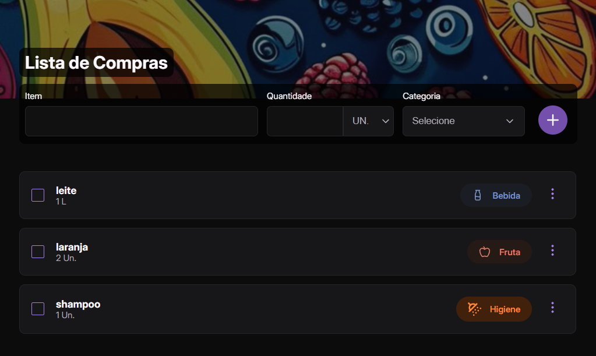

# 🛒 Lista de Compras

Uma aplicação simples e intuitiva para criar sua lista de compras, desenvolvida com **HTML**, **CSS** e **JavaScript**.
Adicione itens, marque como concluídos e gerencie suas compras de forma fácil! ✅

\


---

## 🚀 Como Usar

1. **Adicionar um item**:

   - Digite o nome do item no campo de texto.
   - Selecione a quantidade e a unidade de medida.
   - Escolha a categoria do item.
   - Clique no botão "Adicionar" para incluir o item em sua lista.

2. **Marcar como concluído**:

   - Clique no checkbox ao lado do item para riscá-lo da lista.

3. **Editar ou remover um item**:

   - Clique no ícone de menu (⋮) ao lado do item.
   - Escolha "Editar" para modificar o item ou "Deletar" para removê-lo.

---

## 🛠️ Tecnologias Utilizadas

- **HTML**: Estrutura da página.
- **CSS**: Estilização e design responsivo.
- **JavaScript**: Funcionalidades dinâmicas (adicionar, marcar, editar e remover itens).
- **LocalStorage**: Armazena os itens no navegador para persistência de dados.

---

## 📂 Estrutura do Projeto
A estrutura do projeto está organizada para facilitar a manutenção e escalabilidade do código:
```
lista-de-compras/
├── index.html                 # Página principal
├── styles/                     # Pasta de estilos
│   ├── style.css               # Estilos principais
│   ├── cabecalho.css           # Estilos do cabeçalho
│   ├── formulario.css          # Estilos do formulário
│   ├── categoria.css           # Estilos das categorias
│   ├── unidade.css             # Estilos das unidades de medida
│   └── reset.css               # Reset de estilos
├── script.js                   # Lógica da aplicação
├── assets/                     # Pasta para imagens e ícones
│   ├── preview.png             # Imagem de preview
│   ├── banner-1.jpg            # Imagem do cabeçalho
│   ├── ver-lista.svg           # Ícone de lista
│   └── ...                     # Outros ícones e imagens
└── README.md                   # Documentação do projeto
```

---

## 🔧 Como Executar Localmente

1. Clone o repositório:
   ```bash
   git clone https://github.com/perazzavera/lista-de-compras.git
   ```
2. Navegue até a pasta do projeto:
   ```bash
   cd lista-de-compras
   ```
3. Abra o arquivo `index.html` no navegador:
   - Windows:
     ```bash
     start index.html
     ```
   - macOS:
     ```bash
     open index.html
     ```
   - Linux:
     ```bash
     xdg-open index.html
     ```
- Alternativamente, se tiver o VS Code instalado, use a extensão "Live Server" para abrir o projeto.

---

## 🌐 Deploy

A aplicação está disponível online via GitHub Pages. Acesse:

🔗 [**Link para o Deploy**](#) *(Adicione o link quando estiver pronto!)*

---

## 📝 Licença

Este projeto está sob a **licença MIT**. Consulte o arquivo `LICENSE` para mais detalhes.

---

## 🙌 Contribuição

Contribuições são super bem-vindas! Para colaborar:

1. Faça um **fork** do repositório.
2. Crie uma **branch** para sua feature:
   ```bash
   git checkout -b feature/minha-nova-feature
   ```
3. Commit suas mudanças:
   ```bash
   git commit -m "Adicionando minha nova feature"
   ```
4. Envie para o repositório remoto:
   ```bash
   git push origin feature/minha-nova-feature
   ```
5. Abra um **Pull Request**. 🎉

---

## 📧 Contato

📌 **Vera Lucia Perazza**  
📩 Email: [vperazza5@gmail.com](mailto:vperazza5@gmail.com)  
🐙 GitHub: [perazzavera](https://github.com/perazzavera)

---

🚀 *Boas compras e bom desenvolvimento!* 😊

